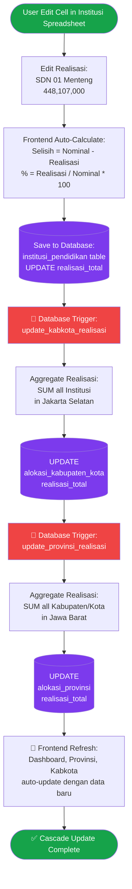
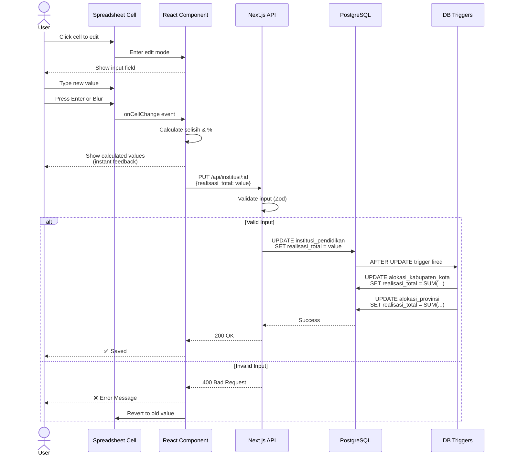

# System Flowchart Diagrams v2
# Transparansi Anggaran Pendidikan - Spreadsheet Interface

**Version**: 2.0  
**Date**: April 13, 2026  
**Interface Type**: Excel-like Spreadsheet Dashboard

---

## 📐 Diagram Overview

Dokumen ini berisi 5 diagram utama untuk sistem spreadsheet interface:

1. **System Architecture** - High-level tech stack & components
2. **Menu Structure & Navigation** - Simplified menu hierarchy
3. **Data Flow & Cascade Update** - How data propagates from Institusi → Kabkota → Provinsi
4. **User Interaction Flow** - Complete user journey
5. **Database ER Diagram** - Simplified database schema

---

## 1️⃣ System Architecture - Spreadsheet Interface

```mermaid
graph TB
    subgraph "Frontend Layer - Spreadsheet UI"
        UI[React Components]
        RDG[react-data-grid<br/>Excel-like Table]
        Charts[Recharts<br/>Dashboard Charts]
        Forms[React Hook Form<br/>User Management]
    end
    
    subgraph "State Management"
        Zustand[Zustand Store<br/>Global State]
        LocalState[React useState<br/>Local Component State]
    end
    
    subgraph "API Layer - Next.js API Routes"
        Auth[/api/auth]
        Dashboard[/api/dashboard]
        Provinsi[/api/provinsi]
        Kabkota[/api/kabupaten-kota]
        Institusi[/api/institusi]
        Users[/api/users]
        Export[/api/export]
    end
    
    subgraph "Business Logic"
        Validation[Zod Validation]
        Calculation[Real-time Calculations:<br/>Selisih, %]
        Export Logic[ExcelJS Export<br/>with Formula]
    end
    
    subgraph "Database Layer"
        PG[(PostgreSQL 15+)]
        Drizzle[Drizzle ORM]
        Triggers[Database Triggers<br/>Cascade Update]
        Computed[Generated Columns<br/>selisih, %]
    end
    
    UI --> RDG
    UI --> Charts
    UI --> Forms
    RDG --> Zustand
    Forms --> LocalState
    
    UI --> Auth
    UI --> Dashboard
    UI --> Provinsi
    UI --> Kabkota
    UI --> Institusi
    UI --> Users
    UI --> Export
    
    Auth --> Validation
    Dashboard --> Calculation
    Provinsi --> Calculation
    Kabkota --> Calculation
    Institusi --> Calculation
    
    Provinsi --> Drizzle
    Kabkota --> Drizzle
    Institusi --> Drizzle
    
    Export --> ExportLogic[Export Logic]
    
    Drizzle --> PG
    PG --> Triggers
    PG --> Computed
    
    style UI fill:#3b82f6,color:#fff
    style RDG fill:#10b981,color:#fff
    style PG fill:#7c3aed,color:#fff
    style Triggers fill:#ef4444,color:#fff
```

---

## 2️⃣ Menu Structure & Navigation


    
    Kabkota --> KabFilter[Filter by Provinsi]
    Kabkota --> KabTable[Spreadsheet Table:<br/>Kabupaten/Kota<br/>Cascade Update]
    
    Universitas --> InstFilter[Filter: Provinsi,<br/>Kabkota, Search]
    Universitas --> InstTable[Spreadsheet Table:<br/>Pagination 100/page]
    
    SMA --> InstFilter2[Same as Universitas]
    SMP --> InstFilter3[Same as Universitas]
    SD --> InstFilter4[Same as Universitas]
    PAUD --> InstFilter5[Same as Universitas]
    
    Users --> UserCRUD[CRUD Users:<br/>Add, Edit, Delete]
    Users --> UserRBAC[Role Assignment:<br/>SUPER_ADMIN, ADMIN,<br/>VIEWER, etc.]
    


**Navigation Rules**:
- Click menu item → Load page
- Sidebar dengan collapsible submenu (Jenjang Pendidikan)
- Active menu item highlighted
- No multi-level dashboard (single unified interface)

---

## 3️⃣ Data Flow & Cascade Update



**Data Propagation Direction**:
```
Institusi (SD/SMP/SMA/dll)
    ↓ Trigger: update_kabkota_realisasi
Kabupaten/Kota
    ↓ Trigger: update_provinsi_realisasi
Provinsi
    ↓ Query Aggregation
Dashboard (National Summary)
```

**Real-Time Calculation**:
- **Frontend**: Immediate visual feedback (calculate before save)
- **Database**: Generated columns for `selisih` dan `persentase_penyerapan`
- **Triggers**: Auto-propagate realisasi ke parent entities

---

## 4️⃣ User Interaction Flow - Complete Journey

```mermaid
flowchart TD
    Start([User Opens App]) --> Login[Login Page]
    
    Login --> InputCred[Input Username<br/>& Password]
    InputCred --> ValidAuth{Valid<br/>Credentials?}
    
    ValidAuth -->|No| ErrorMsg[❌ Error:<br/>Invalid Login]
    ValidAuth -->|Yes| CheckRole{Check<br/>User Role}
    
    ErrorMsg --> Login
    
    CheckRole --> Dashboard[Redirect to<br/>📊 Dashboard]
    
    Dashboard --> DashView[View Summary:<br/>- Total Nominal<br/>- Total Realisasi<br/>- % Penyerapan<br/>- Per Jenjang Table<br/>- Bar Chart]
    

    PageProv --> ProvActions{Select<br/>Action}
    ProvActions --> EditProv[Click Cell → Edit<br/>Inline Editing]
    ProvActions --> ExportProv[Export to Excel<br/>dengan Formula]
    ProvActions --> RefreshProv[Refresh Data]
    
    EditProv --> AutoSaveProv[Auto-Save to DB<br/>on Blur/Enter]
    AutoSaveProv --> RecalcProv[Recalculate:<br/>Selisih, %]
    RecalcProv --> MenuSelect
    
    ExportProv --> DownloadXLSX[Download .xlsx<br/>with Formula preserved]
    DownloadXLSX --> MenuSelect
    
    %% Kabkota Flow
    PageKabkota --> FilterProv[Select Filter:<br/>Provinsi Dropdown]
    FilterProv --> LoadKabkota[Load Kabupaten/Kota<br/>for selected Provinsi]
    LoadKabkota --> EditKabkota[Edit Cell<br/>Auto-Save]
    EditKabkota --> CascadeUpdate[🔧 Trigger:<br/>Update Parent Provinsi]
    CascadeUpdate --> MenuSelect
    
    %% Jenjang Flow
    PageJenjang --> SelectJenjang{Select<br/>Jenjang}
    SelectJenjang --> LoadJenjang[Load Institusi<br/>Table]
    LoadJenjang --> FilterJenjang[Apply Filters:<br/>Provinsi, Kabkota, Search]
    FilterJenjang --> Pagination[Pagination:<br/>100 items/page]
    Pagination --> EditInstitusi[Edit Cell<br/>Realisasi]
    EditInstitusi --> CascadeInst[🔧 Trigger:<br/>Update Kabkota → Provinsi]
    CascadeInst --> MenuSelect
    
    %% Users Flow
    PageUsers --> UserActions{Select<br/>Action}
    UserActions --> AddUser[+ Add User]
    UserActions --> EditUser[Edit User]
    UserActions --> DeleteUser[Delete User]
    
    AddUser --> UserForm[Fill Form:<br/>Username, Email,<br/>Password, Role]
    UserForm --> SaveUser[Save to DB]
    SaveUser --> MenuSelect
    
    %% Logout
    MenuSelect -->|Logout| LogoutBtn[Click Logout]
    LogoutBtn --> ClearSession[Clear Session<br/>& Tokens]
    ClearSession --> End([Redirect to Login])
    


---

## 5️⃣ Database ER Diagram - Simplified

```mermaid
erDiagram
    tahun_anggaran ||--o{ alokasi_provinsi : has
    provinsi ||--o{ alokasi_provinsi : receives
    provinsi ||--o{ kabupaten_kota : contains
    
    alokasi_provinsi ||--o{ alokasi_kabupaten_kota : distributes
    kabupaten_kota ||--o{ alokasi_kabupaten_kota : receives
    kabupaten_kota ||--o{ institusi_pendidikan : contains
    
    users }o--|| provinsi : "limited to (optional)"
    users }o--|| kabupaten_kota : "limited to (optional)"
    
    tahun_anggaran {
        uuid id PK
        int tahun UK
        decimal total_anggaran
        varchar status
    }
    
    provinsi {
        uuid id PK
        varchar kode_provinsi UK
        varchar nama_provinsi
    }
    
    alokasi_provinsi {
        uuid id PK
        uuid tahun_anggaran_id FK
        uuid provinsi_id FK
        decimal nominal_alokasi
        decimal realisasi_total
        decimal selisih "GENERATED"
        decimal persentase_penyerapan "GENERATED"
    }
    
    kabupaten_kota {
        uuid id PK
        uuid provinsi_id FK
        varchar kode_kabupaten_kota UK
        varchar nama_kabupaten_kota
        varchar tipe
    }
    
    alokasi_kabupaten_kota {
        uuid id PK
        uuid alokasi_provinsi_id FK
        uuid kabupaten_kota_id FK
        decimal nominal_alokasi
        decimal realisasi_total
        decimal selisih "GENERATED"
        decimal persentase_penyerapan "GENERATED"
    }
    
    institusi_pendidikan {
        uuid id PK
        varchar npsn UK
        varchar nama_institusi
        enum jenjang
        uuid kabupaten_kota_id FK
        decimal nominal_alokasi
        decimal realisasi_total
        decimal selisih "GENERATED"
        decimal persentase_penyerapan "GENERATED"
    }
    
    users {
        uuid id PK
        varchar username UK
        varchar email UK
        varchar password_hash
        enum role
        uuid provinsi_id FK "nullable"
        uuid kabupaten_kota_id FK "nullable"
        boolean is_active
    }
```

**Key Database Features**:

1. **Generated Columns**: `selisih` dan `persentase_penyerapan` dihitung otomatis oleh database
   ```sql
   selisih = nominal_alokasi - realisasi_total
   persentase_penyerapan = (realisasi_total / nominal_alokasi) * 100
   ```

2. **Database Triggers**: Auto-update parent saat child berubah
   - `trigger_update_kabkota_realisasi`: Institusi → Kabkota
   - `trigger_update_provinsi_realisasi`: Kabkota → Provinsi

3. **Enum Types**:
   - `role`: SUPER_ADMIN, ADMIN, VIEWER, ADMIN_PROVINSI, ADMIN_KABKOTA, AUDITOR
   - `jenjang`: UNIVERSITAS, SMA, SMP, SD, PAUD

---

## 🎨 Additional Diagrams

### Spreadsheet Cell Editing Flow



---

### Export to Excel Flow

```mermaid
flowchart LR
    Start([User Click Export]) --> FetchData[Fetch Table Data<br/>from Frontend State]
    
    FetchData --> CreateWorkbook[ExcelJS:<br/>Create Workbook]
    
    CreateWorkbook --> AddHeaders[Add Headers:<br/>No, Nama, Nominal,<br/>Realisasi, Selisih, %]
    
    AddHeaders --> AddRows[Add Data Rows:<br/>Loop through data]
    
    AddRows --> AddFormulas[Add Excel Formulas:<br/>E2 = C2 - D2<br/>F2 = D2 / C2 * 100]
    
    AddFormulas --> AddTotalRow[Add TOTAL Row:<br/>C_total = SUM C2:CN<br/>D_total = SUM D2:DN]
    
    AddTotalRow --> AddFormatting[Add Formatting:<br/>- Bold headers<br/>- Number format<br/>- Conditional color]
    
    AddFormatting --> GenerateBuffer[Generate Excel Buffer]
    
    GenerateBuffer --> CreateBlob[Create Blob Object]
    
    CreateBlob --> Download[Trigger Download:<br/>saveAs filename.xlsx]
    
    Download --> End([User Downloads File])
    
    style Start fill:#3b82f6,color:#fff
    style GenerateBuffer fill:#10b981,color:#fff
    style Download fill:#7c3aed,color:#fff
    style End fill:#16a34a,color:#fff
```



---

## 📊 Summary: Key System Flows

### 1. **Login → Dashboard**
```
User Login → Validate Credentials → Set Session → Redirect to Dashboard → Load Summary Data
```

### 2. **Edit Cell → Cascade Update**
```
User Edit Cell (Institusi)
  → Frontend Calculate (instant)
  → API Save to DB
  → DB Trigger: Update Kabkota realisasi_total
  → DB Trigger: Update Provinsi realisasi_total
  → Frontend Refresh (shows updated data)
```

### 3. **Filter & Search**
```
User Select Provinsi Filter
  → Load Kabupaten/Kota for Provinsi
  → User Select Kabkota Filter
  → Load Institusi for Kabkota
  → User Type Search Term
  → Filter Institusi by Name (client-side or server-side)
```

### 4. **Export**
```
User Click Export
  → Fetch Current Table Data
  → ExcelJS Generate Workbook
  → Add Data + Formulas + Formatting
  → Download .xlsx File
```

---

## 🎯 Design Principles

### 1. **Spreadsheet-First Interface**
- UI/UX mirip Excel atau Google Sheets
- Inline cell editing (click → edit → save)
- Keyboard navigation (Tab, Enter, Arrow keys)
- Visual feedback (hover, focus states)

### 2. **Real-Time Calculation**
- Frontend: Immediate calculation untuk UX responsiveness
- Database: Generated columns untuk data integrity
- Triggers: Cascade update untuk consistency

### 3. **Simple Navigation**
- Single-level sidebar menu
- Collapsible submenu (Jenjang Pendidikan)
- No complex dashboard routing
- Consistent layout across all pages

### 4. **Performance**
- Pagination (100 items/page)
- Database indexing
- Query optimization (JOINs instead of N+1)
- Lazy loading untuk large datasets

---

**Document Status**: ✅ APPROVED  
**Version**: 2.0  
**Last Updated**: April 13, 2026
